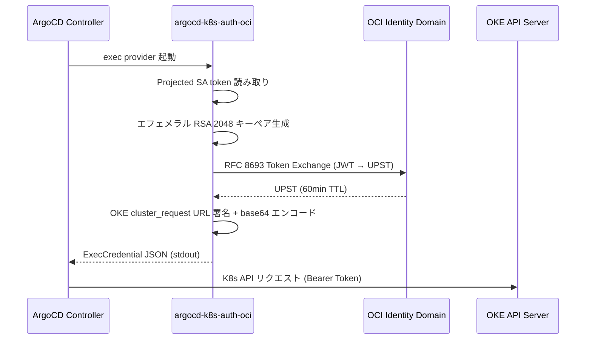

# argocd-k8s-auth-oci

ArgoCD 用の OCI (Oracle Cloud Infrastructure) exec credential provider。OKE (Oracle Kubernetes Engine) クラスターへの認証を、OCI Identity Propagation Trust (OIDC Federation) 経由でゼロシークレットに実現します。

ArgoCD 組み込みの `argocd-k8s-auth` は GCP / AWS / Azure のみ対応しており、OCI は未サポートです。本ツールは外部 exec credential provider として OCI 対応を提供し、ArgoCD から OKE クラスターへの接続を可能にします。

## 認証フロー



1. ArgoCD が cluster secret の `execProviderConfig` に基づき本ツールを起動
2. Kubernetes projected SA token を読み取り、OCI Identity Domain で UPST (User Principal Session Token) に交換
3. UPST とエフェメラル RSA 秘密鍵を使い OKE 認証トークンを生成
4. ExecCredential JSON を stdout に出力し、ArgoCD が Bearer Token として OKE API にリクエスト

静的シークレットは一切使用しません。全フローが短命トークンに基づきます。

## インストール方法

### GHCR からのイメージ取得

```bash
docker pull ghcr.io/na2na-p/argocd-k8s-auth-oci:<version>
```

### ArgoCD への組み込み

ArgoCD の Helm values (controller セクション) に以下を追加します。

```yaml
controller:
  initContainers:
    - name: oci-auth-installer
      image: ghcr.io/na2na-p/argocd-k8s-auth-oci:v0.1.0
      command: ['cp', '/argocd-k8s-auth-oci', '/shared-bin/argocd-k8s-auth-oci']
      volumeMounts:
        - name: oci-auth-bin
          mountPath: /shared-bin
  volumes:
    - name: oci-auth-bin
      emptyDir: {}
    - name: oci-wif-credentials
      projected:
        sources:
          - serviceAccountToken:
              audience: "<OCI_IDENTITY_DOMAIN_URL>"
              expirationSeconds: 3600
              path: token
  volumeMounts:
    - name: oci-auth-bin
      mountPath: /usr/local/bin/argocd-k8s-auth-oci
      subPath: argocd-k8s-auth-oci
    - name: oci-wif-credentials
      mountPath: /var/run/secrets/oci-wif
      readOnly: true
```

ArgoCD の cluster secret で以下のように参照します。

```yaml
apiVersion: v1
kind: Secret
metadata:
  name: target-cluster
  namespace: argocd
  labels:
    argocd.argoproj.io/secret-type: cluster
stringData:
  name: target-cluster
  server: "https://<OKE_PUBLIC_ENDPOINT>:6443"
  config: |
    {
      "execProviderConfig": {
        "command": "argocd-k8s-auth-oci",
        "args": [
          "--identity-domain-url", "<IDCS_ENDPOINT>",
          "--client-id", "<OAUTH_CLIENT_ID>",
          "--cluster-id", "<OKE_CLUSTER_OCID>",
          "--region", "ap-tokyo-1"
        ],
        "apiVersion": "client.authentication.k8s.io/v1beta1",
        "installHint": "https://github.com/na2na-p/argocd-k8s-auth-oci"
      },
      "tlsClientConfig": {
        "caData": "<BASE64_OKE_CA_CERT>"
      }
    }
```

## CLI 使用例

```bash
# ArgoCD exec provider として（通常の使い方）
argocd-k8s-auth-oci \
  --identity-domain-url https://idcs-xxxx.identity.oraclecloud.com \
  --client-id <oauth-app-client-id> \
  --cluster-id ocid1.cluster.oc1.ap-tokyo-1.xxxxx \
  --region ap-tokyo-1 \
  --token-path /var/run/secrets/oci-wif/token

# 手動テスト用（token を stdin から渡す）
cat /var/run/secrets/oci-wif/token | argocd-k8s-auth-oci \
  --identity-domain-url https://idcs-xxxx.identity.oraclecloud.com \
  --client-id <oauth-app-client-id> \
  --cluster-id ocid1.cluster.oc1.ap-tokyo-1.xxxxx \
  --region ap-tokyo-1 \
  --token-path -
```

出力は `client.authentication.k8s.io/v1beta1` の ExecCredential JSON です。

```json
{
  "apiVersion": "client.authentication.k8s.io/v1beta1",
  "kind": "ExecCredential",
  "status": {
    "token": "<base64-encoded-signed-OKE-URL>",
    "expirationTimestamp": "2026-03-29T12:04:00Z"
  }
}
```

## CLI フラグ一覧

| フラグ | 短縮 | 必須 | デフォルト | 説明 |
|--------|------|------|-----------|------|
| `--identity-domain-url` | なし | Yes | -- | OCI Identity Domain URL (例: `https://idcs-xxxx.identity.oraclecloud.com`) |
| `--client-id` | なし | Yes | -- | Token Exchange 用 OAuth App の Client ID |
| `--cluster-id` | なし | Yes | -- | OKE クラスター OCID |
| `--region` | なし | Yes | -- | OCI リージョン (例: `ap-tokyo-1`) |
| `--token-path` | なし | No | `/var/run/secrets/oci-wif/token` | K8s projected SA token のファイルパス。`-` で stdin |
| `--token-lifetime` | なし | No | `4m` | ExecCredential の `expirationTimestamp` に使う有効期限 |
| `--timeout` | なし | No | `10s` | HTTP リクエスト全体のタイムアウト |
| `--debug` | なし | No | `false` | デバッグモード。HTTP ステータス・エラー詳細を stderr に出力 (トークン値はマスク) |
| `--version` | `-v` | No | -- | ビルドバージョン・コミットハッシュを表示して終了 |

## 環境変数

フラグの代わりに環境変数でも指定可能です。フラグが優先されます。

| 環境変数 | 対応フラグ |
|---------|-----------|
| `OCI_IDENTITY_DOMAIN_URL` | `--identity-domain-url` |
| `OCI_CLIENT_ID` | `--client-id` |
| `OCI_CLUSTER_ID` | `--cluster-id` |
| `OCI_REGION` | `--region` |
| `OCI_TOKEN_PATH` | `--token-path` |

## 開発方法

### 前提条件

- Go 1.26.1 以上
- golangci-lint v2.11.4 以上

### ビルド

```bash
go build .
```

### テスト

```bash
go test ./...
```

### リント

```bash
golangci-lint run
```

## ライセンス

MIT License。詳細は [LICENSE](LICENSE) を参照してください。
