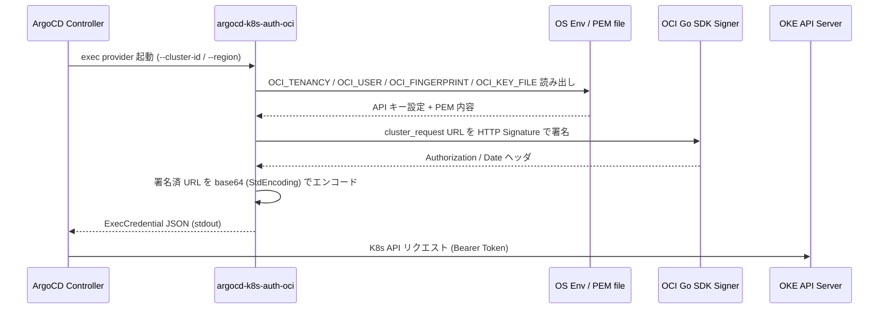

# argocd-k8s-auth-oci

ArgoCD 向けの OCI (Oracle Cloud Infrastructure) Container Engine for Kubernetes (OKE) 用 exec credential provider です。OCI API キーを用いて `containerengine.<region>.oraclecloud.com/cluster_request/<cluster-id>` を OCI HTTP Signature で署名し、OKE が受理する bearer token を ExecCredential JSON として返します。

ArgoCD 組み込みの `argocd-k8s-auth` は GCP / AWS / Azure のみ対応しており、OCI は未サポートです。本ツールは外部 exec credential provider として OCI 対応を提供し、ArgoCD から OKE への接続を可能にします。

## 背景

旧版 (v2026.04.xx 以前) は Kubernetes projected SA token を OCI Identity Domain で UPST (User Principal Session Token) に交換する「keyless」設計でした。しかし Oracle 公式ドキュメントが外部 K8s → OKE 接続を Workload Identity Federation でのみサポートしており、Service User の `ttype=te` UPST が OKE 側で 401 になることが PoC で確定したため、本 minor 以降は **OCI API キー認証経路へ pivot** しています。env 名は [mattn/oci-cluster-token](https://github.com/mattn/oci-cluster-token) と互換性のあるキー (`OCI_*`) を採用しています。

## 認証フロー


```mermaid
sequenceDiagram
    participant ArgoCD as ArgoCD Controller
    participant Exec as argocd-k8s-auth-oci
    participant Env as OS Env / PEM file
    participant SDK as OCI Go SDK Signer
    participant OKE as OKE API Server

    ArgoCD->>Exec: exec provider 起動 (--cluster-id / --region)
    Exec->>Env: OCI_TENANCY / OCI_USER / OCI_FINGERPRINT / OCI_KEY_FILE 読み出し
    Env-->>Exec: API キー設定 + PEM 内容
    Exec->>SDK: cluster_request URL を HTTP Signature で署名
    SDK-->>Exec: Authorization / Date ヘッダ
    Exec->>Exec: 署名済 URL を base64 (StdEncoding) でエンコード
    Exec-->>ArgoCD: ExecCredential JSON (stdout)
    ArgoCD->>OKE: K8s API リクエスト (Bearer Token)
```

1. ArgoCD が cluster secret の `execProviderConfig` に基づき本ツールを起動します。
2. 環境変数から OCI API キー設定 (tenancy / user / fingerprint / key file path 等) を読み出します。
3. `https://containerengine.<region>.oraclecloud.com/cluster_request/<cluster-id>` に対する GET リクエストを OCI Go SDK の `DefaultRequestSigner` で署名します。署名は in-memory で完結し、OCI 側への HTTP リクエストは発生しません。
4. 署名後の URL (`authorization` / `date` を query parameter として持つ) を標準 base64 でエンコードし、ExecCredential JSON の `status.token` として stdout に出力します。
5. ArgoCD がその bearer token で OKE API サーバーへ接続します。

## 必要なもの

- OCI テナント上のユーザーに紐付いた **API 署名キー** (PEM 形式の RSA 秘密鍵)
- 同ユーザー / グループに、対象 OKE クラスターへの `use cluster` 権限を付与する IAM ポリシー
- ArgoCD Application Controller (および必要に応じて ApplicationSet / Server) の Pod に PEM ファイルと env を注入する仕組み (ExternalSecret + ConfigMap 等)

## 環境変数

| 環境変数 | 必須 | 説明 |
|---------|------|------|
| `OCI_CLUSTER_ID` | Yes (\*) | OKE クラスター OCID |
| `OCI_REGION` | Yes (\*) | OCI リージョン (例: `ap-tokyo-1`) |
| `OCI_TENANCY` | Yes | テナント OCID |
| `OCI_USER` | Yes | API キー所有ユーザーの OCID |
| `OCI_FINGERPRINT` | Yes | API キーの fingerprint |
| `OCI_KEY_FILE` | Yes | API キー秘密鍵 PEM のファイルパス |
| `OCI_PASSPHRASE` | No | PEM 秘密鍵が暗号化されている場合のパスフレーズ |

(\*) `OCI_CLUSTER_ID` / `OCI_REGION` は CLI フラグ `--cluster-id` / `--region` でも指定可能で、フラグが優先されます。それ以外の env はすべて環境変数経由で指定する必要があります (対応する CLI フラグは存在しません)。

環境変数名は [mattn/oci-cluster-token](https://github.com/mattn/oci-cluster-token) と互換性を保つため `OCI_*` を採用しています (`OCI_CLI_*` ではありません)。

## CLI フラグ

| フラグ | 短縮 | 必須 | デフォルト | 説明 |
|--------|------|------|-----------|------|
| `--cluster-id` | なし | Yes | -- | OKE クラスター OCID (env: `OCI_CLUSTER_ID`) |
| `--region` | なし | Yes | -- | OCI リージョン (env: `OCI_REGION`) |
| `--token-lifetime` | なし | No | `4m` | ExecCredential の `expirationTimestamp` に反映する有効期限 |
| `--timeout` | なし | No | `10s` | OKE token 生成に紐付ける context のタイムアウト (詳細後述) |
| `--debug` | なし | No | `false` | デバッグログを stderr に出力する。tenancy / user / fingerprint は前後 4 文字以外をマスク |
| `--version` | `-v` | No | -- | バージョンと commit hash を表示して終了 |

旧 UPST 経路で利用していた `--identity-domain-url` / `--client-id` / `--client-secret` / `--token-path` フラグは **完全に削除** しています。旧フラグを指定すると cobra が unknown flag エラーで終了します。

### `--timeout` の現状

現バージョンの `oke.Generate` は OCI HTTP Signature 署名を in-memory で行う実装であり、OCI への実 HTTP 通信は発生しません。`--timeout` は context にひも付くタイムアウトとして指定されますが、実質的にトリガされる箇所は現状ありません。将来署名処理を HTTP 化した場合の挙動を変えないための placeholder として保持しています (バグではなく設計上の意図)。

## エラー分類

`runRoot` は分類しやすいプレフィックスを付けてエラーを返します。ArgoCD ログから運用上の問題を切り分けやすくするためです。

| プレフィックス | 識別 sentinel | 想定原因 |
|----------------|---------------|----------|
| `OCI authentication configuration error: ...` | `errors.Is(err, auth.ErrRequiredEnvMissing)` | 必須環境変数 (`OCI_TENANCY` 等) が未設定 / 空文字 |
| `OCI key file error: ...` | `errors.Is(err, auth.ErrKeyFileRead)` | `OCI_KEY_FILE` が指す PEM が読めない (不存在 / 権限不足等) |
| `failed to load OCI authentication configuration: ...` | 上記以外 | env 読み込み段階のその他失敗 |
| `failed to build OCI ConfigurationProvider: ...` | 上記以外 | OCI SDK の `NewRawConfigurationProvider` 構築失敗 |
| `OKE token generation error: ...` | -- | 署名失敗 / context cancel 等 |
| `failed to format ExecCredential: ...` | -- | JSON 整形失敗 |

## ArgoCD への組み込み

### 1. PEM とイメージの配備

bundle イメージ (`ghcr.io/na2na-p/argocd-k8s-auth-oci:<calver>`) を initContainer から `oci-auth-bin` の emptyDir に cp し、Application Controller / Server の Pod から `/usr/local/bin/argocd-k8s-auth-oci` として参照できるようにします。OCI API キーの PEM は ExternalSecret 等で Secret 化し、専用の volume mount で Pod 内に配置します。

```yaml
controller:
  initContainers:
    - name: oci-auth-installer
      image: ghcr.io/na2na-p/argocd-k8s-auth-oci:<calver>
      command: ['cp', '/argocd-k8s-auth-oci', '/shared-bin/argocd-k8s-auth-oci']
      volumeMounts:
        - name: oci-auth-bin
          mountPath: /shared-bin
  volumes:
    - name: oci-auth-bin
      emptyDir: {}
    - name: oci-api-key
      secret:
        secretName: oci-api-key
        items:
          - key: private_key.pem
            path: private_key.pem
            mode: 0400
  volumeMounts:
    - name: oci-auth-bin
      mountPath: /usr/local/bin/argocd-k8s-auth-oci
      subPath: argocd-k8s-auth-oci
    - name: oci-api-key
      mountPath: /var/run/secrets/oci
      readOnly: true
  envFrom:
    - configMapRef:
        name: argocd-oci-auth-env
    - secretRef:
        name: argocd-oci-auth-secrets
```

`argocd-oci-auth-env` ConfigMap には `OCI_TENANCY` / `OCI_USER` / `OCI_REGION` / `OCI_FINGERPRINT` / `OCI_KEY_FILE` (`/var/run/secrets/oci/private_key.pem`) を、`argocd-oci-auth-secrets` Secret には必要なら `OCI_PASSPHRASE` を入れます。

### 2. ArgoCD cluster secret

OKE クラスターを ArgoCD に登録する cluster secret の `execProviderConfig` に本ツールを指定します。`OCI_CLUSTER_ID` / `OCI_REGION` を ConfigMap で全 Pod に流す運用にしておけば args は省略可能ですが、クラスター単位で上書きしたい場合は args 経由で渡せます。

```yaml
apiVersion: v1
kind: Secret
metadata:
  name: target-cluster
  namespace: argocd
  labels:
    argocd.argoproj.io/secret-type: cluster
stringData:
  name: target-cluster
  server: "https://<OKE_PUBLIC_ENDPOINT>:6443"
  config: |
    {
      "execProviderConfig": {
        "command": "argocd-k8s-auth-oci",
        "args": [
          "--cluster-id", "ocid1.cluster.oc1.ap-tokyo-1.xxxxx",
          "--region", "ap-tokyo-1"
        ],
        "apiVersion": "client.authentication.k8s.io/v1beta1",
        "installHint": "https://github.com/na2na-p/argocd-k8s-auth-oci"
      },
      "tlsClientConfig": {
        "caData": "<BASE64_OKE_CA_CERT>"
      }
    }
```

`tlsClientConfig.caData` は OKE クラスターの kubeconfig に含まれる CA 証明書を base64 化したものです (本ツールではなく ArgoCD が直接利用)。

## 出力フォーマット

stdout には `client.authentication.k8s.io/v1beta1` の ExecCredential JSON を 1 行で書き出します。

```json
{
  "apiVersion": "client.authentication.k8s.io/v1beta1",
  "kind": "ExecCredential",
  "status": {
    "token": "<base64-encoded-signed-OKE-URL>",
    "expirationTimestamp": "2026-06-15T12:04:00Z"
  }
}
```

## ローカル動作確認

```bash
export OCI_TENANCY=ocid1.tenancy.oc1..xxxx
export OCI_USER=ocid1.user.oc1..xxxx
export OCI_REGION=ap-tokyo-1
export OCI_FINGERPRINT=aa:bb:cc:...
export OCI_KEY_FILE=$HOME/.oci/oci_api_key.pem
# 必要なら export OCI_PASSPHRASE=...

go run . \
  --cluster-id ocid1.cluster.oc1.ap-tokyo-1.xxxxx \
  --region ap-tokyo-1 \
  --debug
```

`--debug` を付けると tenancy / user / fingerprint / key file path などを stderr に流します (値は前後 4 文字以外をマスクします)。

## 開発

### 前提

- Go 1.26.1 以上
- golangci-lint v2.11.4 以上

### ビルド

```bash
go build .
```

### テスト

```bash
go test -race ./...
```

### リント

```bash
golangci-lint run
```

### リリース

`main` への push を契機に `.github/workflows/release.yaml` が CalVer (`vYYYY.MM.DD[.N]`) で tag を切り、`ghcr.io/na2na-p/argocd-k8s-auth-oci:<version>` を multi-arch (`linux/amd64`, `linux/arm64`) で GHCR に push します。version / commit は `-ldflags="-X main.version=... -X main.commit=..."` 経由でバイナリに埋め込まれます。

## ライセンス

MIT License。詳細は [LICENSE](LICENSE) を参照してください。
